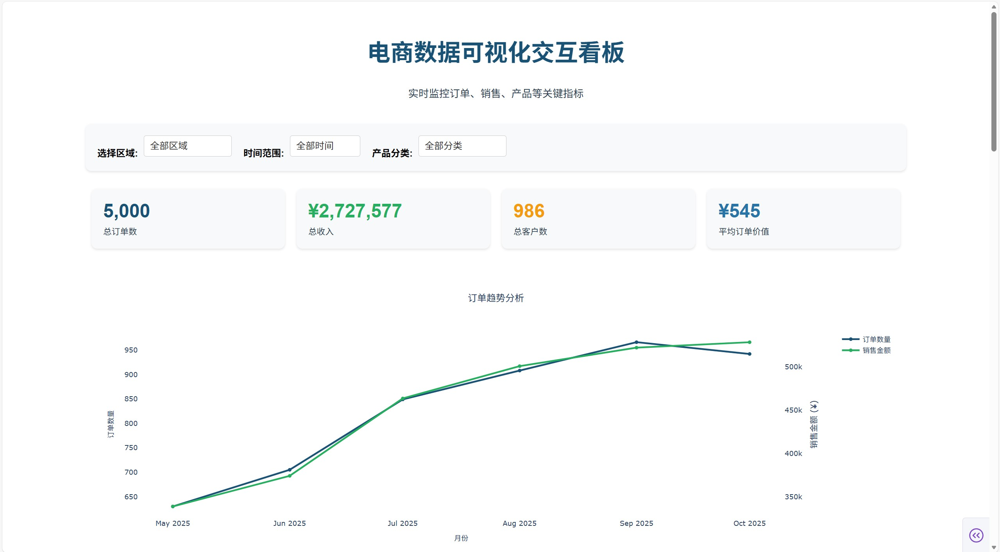

# Python 可视化 (PythonVisualisation)

[](https://www.python.org/)
[](https://jupyter.org/)
[](LICENSE)
[](https://blog.csdn.net/woyych)

<p align="center">
  
</p>

## 📌 项目简介

这是一个专注于 **Python 数据可视化** 的开源项目，汇集了 30 种常见及创意图表的实现方式，涵盖电商、业务分析等典型场景。所有示例均基于模拟数据，可直接用于学习、教学或项目参考。

---

## 🔍可视化效果图预览

<p align="center">
  
</p>

<p align="center">
  
</p>
---

## 🗂️ 项目结构

```text
PythonVisualisation/
├── 可视化/                # 各类可视化示例（Jupyter Notebook）
│   ├── 01、渐变柱形图/
│   ├── 02、带均值柱形图/
│   ├── 03、渐变圆角柱形图/
│   ├── 04、标注柱形图/
│   ├── 05、层叠柱形图/
│   ├── 06、蝴蝶图/
│   ├── 07、对称蝴蝶图/
│   ├── 08、数值百分比/
│   ├── 09、对比柱形图/
│   ├── 10、甘特图/
│   ├── 11、平滑折线图/
│   ├── 12、菱形走势图/
│   ├── 13、对比折线图/
│   ├── 14、单值圆环图/
│   ├── 15、水球图/
│   ├── 16、波浪水球图/
│   ├── 17、玉玦图/
│   ├── 18、跑道图/
│   ├── 19、南丁格尔圆饼图/
│   ├── 20、南丁格尔圆环图/
│   ├── 21、南丁格尔（PPT风格）/
│   ├── 22、仪表盘图/
│   ├── 23、柱形折线图/
│   ├── 24、目标柱形图/
│   ├── 25、子弹图/
│   ├── 26、柱形圆/
│   ├── 27、簇状柱形折线图/
│   ├── 28、复合柱形图/
│   ├── 29、滑珠图/
│   └── 30、对比滑珠图/
├── 交互面板/              # 基于Dash的交互式可视化看板
│   └── dashboard_app.py
└── 数据生成/
    └── fake.py            # 模拟电商数据生成脚本
```

---

## 📊 数据生成

项目提供 `fake.py` 脚本，用于一键生成模拟电商数据集，便于快速启动可视化实验。

### 生成的数据文件包括：

- `user_unique_compare.csv`：1000 条模拟用户信息  
- `spu_manages_feishu.csv`：200 个商品 SPU（标准产品单元）  
- `sku_data_base.csv`：基于 SPU 生成的 SKU（库存量单位）明细  
- `new_sku_sales.csv`：SKU 销售统计数据  
- `erp_order.csv`：5000 条模拟订单记录  

### 依赖库

- `faker`：生成逼真的模拟数据  
- `pandas`：数据处理与导出 CSV  
- `random` / `datetime`：辅助生成随机值与时间序列  

### 使用方式

```bash
python 数据生成/fake.py
```

---

## 📈 可视化示例分类

### 📊 柱形图系列
- 渐变柱形图
- 带均值柱形图
- 渐变圆角柱形图
- 标注柱形图
- 层叠柱形图
- 对比柱形图
- 目标柱形图
- 复合柱形图
- 子弹图
- 柱形圆
- 簇状柱形折线图


### 📉 折线图系列
- 平滑折线图
- 菱形走势图
- 对比折线图
- 柱形折线图

### 🥧 饼图 / 圆环图系列
- 单值圆环图
- 南丁格尔玫瑰图
- 南丁格尔圆环图
- PPT 风格南丁格尔图
- 玉玦图
- 跑道图

### 🎯 特色图表
- 蝴蝶图（含对称变体）
- 数值百分比图
- 甘特图
- 水球图
- 波浪水球图
- 仪表盘图
- 滑珠图 
- 对比滑珠图

## 🛠️ 技术栈

项目采用多种主流 Python 可视化库实现不同风格图表：

- **Matplotlib**：基础绘图
- **Seaborn**：统计图表美化
- **Plotly**：交互式可视化
- **Pyecharts**：ECharts 风格高级图表
- **Dash**：交互式Web应用框架（用于交互面板）

> 建议在 Jupyter Notebook 环境中运行单图表，使用交互面板进行综合数据分析。

## ▶️ 快速开始

### 1. 克隆项目
```bash
git clone https://github.com/IIawaII/PythonVisualisation.git
cd PythonVisualisation
```

### 2. 安装依赖

```bash
pip install -r requirements.txt
```

### 3. 启动 Jupyter Notebook

```bash
jupyter notebook
```

### 4. 打开可视化示例

在 Jupyter Notebook 中打开 `可视化` 文件夹，即可查看和运行各个可视化示例。

### 5. 启动交互式看板

```bash
python dashboard_app.py
```

然后在浏览器中访问 `http://127.0.0.1:8050` 查看交互式看板。

---

## 📝 许可证

本项目采用 MIT 许可证。请查看 `LICENSE` 文件了解更多信息。
